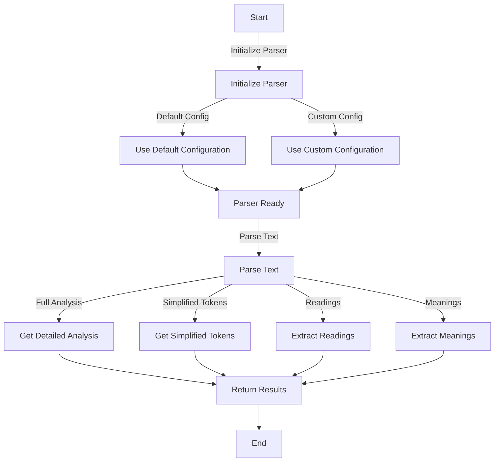

```mermaid
flowchart TD
    Start[Start] -->|Initialize Parser| InitParser[Initialize Parser]
    InitParser -->|Default Config| DefaultConfig[Use Default Configuration]
    InitParser -->|Custom Config| CustomConfig[Use Custom Configuration]
    
    DefaultConfig --> Ready[Parser Ready]
    CustomConfig --> Ready

    Ready -->|Parse Text| ParseText[Parse Text]
    ParseText -->|Full Analysis| FullAnalysis[Get Detailed Analysis]
    ParseText -->|Simplified Tokens| SimpleTokens[Get Simplified Tokens]
    ParseText -->|Readings| Readings[Extract Readings]
    ParseText -->|Meanings| Meanings[Extract Meanings]

    FullAnalysis --> Results[Return Results]
    SimpleTokens --> Results
    Readings --> Results
    Meanings --> Results

    Results --> End[End]
```